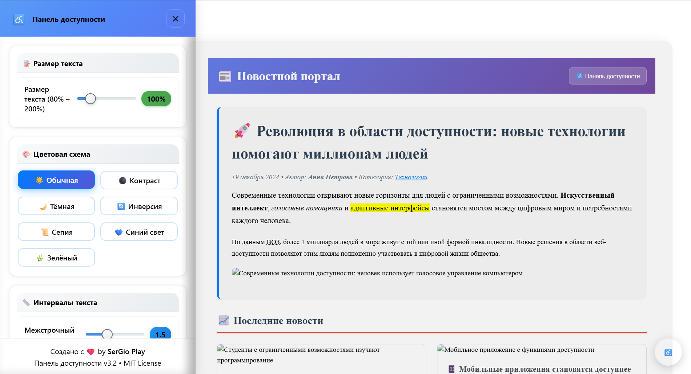

# 🌟 Универсальная панель доступности v3.2

Современная и функциональная панель доступности для веб-сайтов с поддержкой множества настроек и адаптивным дизайном.

[](https://youtu.be/oz47SHfmAOA)

## ✨ Основные возможности

### 🎨 Визуальные настройки
- **Размер текста**: от 80% до 200% с плавным изменением
- **Цветовые схемы**: 7 различных режимов (обычная, высокий контраст, тёмная, инверсия, сепия, синий свет, зелёная)
- **Интервалы текста**: межстрочный, межбуквенный, между словами
- **Визуальные улучшения**: подчеркивание ссылок, выделение заголовков и ссылок
- **Размер курсора**: 3 варианта размера с анимированными переходами

### ⚡ Анимации и эффекты
- **Скорость анимаций**: от полного отключения до быстрых переходов
- **Эффекты фокуса**: обычный, усиленный, сильный с цветовой индикацией
- **Плавность прокрутки**: включение/отключение smooth scroll

### 🔊 Озвучка и звук
- **Линейка чтения с озвучкой**: визуальная подсказка с голосовым сопровождением
- **Озвучка при наведении**: автоматическое чтение элементов при hover
- **Настройки речи**: скорость (0.5x-2.0x) и громкость (10%-100%)
- **Поддержка Web Speech API**: современные голосовые технологии

### ♿ Специальные возможности
- **Режим без изображений**: скрытие всех медиа-элементов
- **Клавиатурная навигация**: улучшенная поддержка Tab-навигации
- **Режим дислексии**: специальный шрифт OpenDyslexic и оптимальные интервалы
- **Увеличенные области фокуса**: для пользователей с моторными нарушениями

### � Упрачвление профилями
- **Автосохранение**: настройки сохраняются в localStorage
- **Профили пользователей**: создание и загрузка пользовательских конфигураций
- **Сброс настроек**: мгновенный возврат к значениям по умолчанию
- **Экспорт/импорт**: возможность переноса настроек между устройствами

## 🚀 Быстрый старт

### Подключение

1. **Скачайте файлы**:
   ```
   accessibility.css  - стили панели (минифицированная версия)
   accessibility.js   - функциональность (ES6+ совместимость)
   index.html        - демо-страница с примерами
   ```

2. **Подключите в HTML**:
```html
<!DOCTYPE html>
<html lang="ru">
<head>
    <meta charset="UTF-8">
    <meta name="viewport" content="width=device-width, initial-scale=1.0">
    <link rel="stylesheet" href="accessibility.css">
    <title>Ваш сайт с панелью доступности</title>
</head>
<body>
    <!-- Оберните основной контент в .page-content -->
    <div class="page-content">
        <header>
            <h1>Ваш сайт</h1>
            <!-- Опциональная кнопка в хедере -->
            <button class="accessibility-toggle">♿ Доступность</button>
        </header>
        
        <main>
            <!-- Ваш основной контент -->
        </main>
    </div>
    
    <!-- Подключение панели (создается автоматически) -->
    <script src="accessibility.js"></script>
    <script>
        // Панель инициализируется автоматически
        document.addEventListener('DOMContentLoaded', () => {
            console.log('Панель доступности готова!');
        });
    </script>
</body>
</html>
```

### Автоматическая инициализация

Панель инициализируется автоматически и создает:
- 🔘 Плавающую кнопку в правом нижнем углу
- 📋 Боковую панель с настройками
- 🔊 Систему объявлений для скринридеров
- ⚙️ Все необходимые обработчики событий

## ⚙️ Расширенная настройка

### Кастомная инициализация

```javascript
// Инициализация с пользовательскими параметрами
const panel = new AccessibilityPanel({
    panel: '#myAccessibilityPanel',
    floatingBtn: '.my-accessibility-btn',
    contentWrapper: '.main-content',
    // Дополнительные настройки
    autoSave: true,
    defaultSettings: {
        fontSize: 1.2,
        contrast: 'normal',
        animations: true
    }
});
```

### Доступные опции конфигурации

```javascript
const config = {
    // Селекторы элементов
    panel: '#accessibilityPanel',
    overlay: '#accessibilityOverlay', 
    floatingBtn: '.floating-accessibility-btn',
    headerBtn: '.accessibility-toggle',
    closeBtn: '.close-panel',
    announcer: '#sr-announcements',
    contentWrapper: '.page-content',
    
    // Настройки поведения
    autoSave: true,                    // Автосохранение настроек
    keyboardShortcuts: true,           // Горячие клавиши (Alt+A)
    announceChanges: true,             // Озвучка изменений
    persistSettings: true,             // Сохранение между сессиями
    
    // Настройки по умолчанию
    defaultSettings: {
        fontSize: 1.0,
        contrast: 'normal',
        lineHeight: 1.5,
        // ... другие настройки
    }
};
```

## 🎯 API и методы

### Основные методы управления

```javascript
// Управление панелью
panel.openPanel();                     // Открыть панель
panel.closePanel();                    // Закрыть панель
panel.togglePanel();                   // Переключить состояние

// Применение настроек
panel.setCustomFontSize(1.5);          // Размер текста (150%)
panel.setContrast('dark');             // Цветовая схема
panel.setLineHeight(1.8);              // Межстрочный интервал
panel.setLetterSpacing(2);             // Межбуквенный интервал
panel.enableDyslexiaMode(true);        // Режим дислексии

// Управление настройками
panel.saveSettings();                  // Сохранить текущие
panel.restoreSettings();               // Восстановить сохранённые
panel.resetSettings();                 // Сбросить к умолчанию
panel.exportSettings();               // Экспорт в JSON
panel.importSettings(jsonData);       // Импорт из JSON

// Профили пользователей
panel.saveProfile('myProfile');        // Сохранить именованный профиль
panel.loadProfile('myProfile');        // Загрузить профиль
panel.deleteProfile('myProfile');      // Удалить профиль
panel.listProfiles();                  // Список всех профилей
```

### События и колбэки

```javascript
// Основные события панели
document.addEventListener('accessibilityPanelOpened', (e) => {
    console.log('Панель открыта');
});

document.addEventListener('accessibilityPanelClosed', (e) => {
    console.log('Панель закрыта');
});

// События изменения настроек
document.addEventListener('accessibilitySettingChanged', (e) => {
    console.log('Настройка изменена:', {
        setting: e.detail.setting,
        value: e.detail.value,
        oldValue: e.detail.oldValue
    });
});

// События профилей
document.addEventListener('accessibilityProfileSaved', (e) => {
    console.log('Профиль сохранён:', e.detail.profileName);
});

document.addEventListener('accessibilityProfileLoaded', (e) => {
    console.log('Профиль загружен:', e.detail.profileName);
});

// Горячие клавиши
document.addEventListener('keydown', (e) => {
    if (e.altKey && e.key === 'a') {
        panel.togglePanel(); // Alt+A для переключения панели
    }
});
```

## 🎨 Кастомизация и темизация

### CSS переменные для быстрой настройки

```css
:root {
    /* Основные цвета */
    --accessibility-primary: #4A90E2;
    --accessibility-secondary: #5856D6;
    --accessibility-success: #34c759;
    --accessibility-warning: #ff9500;
    --accessibility-danger: #ff3b30;
    
    /* Фоны и поверхности */
    --accessibility-background: #ffffff;
    --accessibility-surface: #f8f9fa;
    --accessibility-overlay: rgba(0, 0, 0, 0.5);
    
    /* Текст */
    --accessibility-text-primary: #2c3e50;
    --accessibility-text-secondary: #6c757d;
    --accessibility-text-muted: #adb5bd;
    
    /* Размеры */
    --accessibility-panel-width: 420px;
    --accessibility-border-radius: 12px;
    --accessibility-shadow: 0 4px 20px rgba(0, 0, 0, 0.1);
}
```

### Кастомные темы

```css
/* Тёмная тема для панели */
[data-theme="dark"] .accessibility-panel {
    --accessibility-background: #1a1a1a;
    --accessibility-surface: #2d3748;
    --accessibility-text-primary: #e2e8f0;
    --accessibility-text-secondary: #a0aec0;
}

/* Высококонтрастная тема */
[data-theme="high-contrast"] .accessibility-panel {
    --accessibility-background: #000000;
    --accessibility-surface: #ffffff;
    --accessibility-text-primary: #ffffff;
    --accessibility-primary: #ffff00;
}
```

### Переопределение компонентов

```css
/* Кастомная кнопка */
.floating-accessibility-btn {
    background: linear-gradient(135deg, #667eea 0%, #764ba2 100%);
    width: 70px;
    height: 70px;
    bottom: 30px;
    right: 30px;
}

/* Кастомная панель */
.accessibility-panel {
    width: 500px;
    border-radius: 20px;
    box-shadow: 0 20px 60px rgba(0, 0, 0, 0.2);
}

/* Кастомные ползунки */
input[type="range"] {
    --slider-color: #your-brand-color;
    --slider-bg: #your-bg-color;
}
```

## 📱 Адаптивность и кроссплатформенность

### Поддерживаемые устройства
- 🖥️ **Десктоп**: полная функциональность, все возможности
- 📱 **Планшеты**: адаптированный интерфейс, сенсорное управление
- 📱 **Смартфоны**: оптимизированное управление, увеличенные кнопки
- ⌚ **Умные часы**: базовая поддержка через голосовые команды

### Адаптивные брейкпоинты

```css
/* Большие экраны */
@media (min-width: 1200px) {
    .accessibility-panel { width: 450px; }
}

/* Планшеты */
@media (max-width: 1024px) {
    .accessibility-panel { width: 380px; }
}

/* Мобильные устройства */
@media (max-width: 768px) {
    .accessibility-panel { width: 340px; }
}

/* Маленькие экраны */
@media (max-width: 480px) {
    .accessibility-panel { width: 100%; }
}
```

## 🌐 Поддержка браузеров и технологий

### Браузеры
- ✅ **Chrome 60+** (полная поддержка)
- ✅ **Firefox 55+** (полная поддержка)
- ✅ **Safari 12+** (полная поддержка)
- ✅ **Edge 79+** (полная поддержка)
- ✅ **Opera 47+** (полная поддержка)
- ✅ **iOS Safari 12+** (адаптированная версия)
- ✅ **Android Chrome 60+** (адаптированная версия)

### Вспомогательные технологии
- 🔊 **NVDA** - полная совместимость
- 🔊 **JAWS** - полная совместимость  
- 🔊 **VoiceOver** (macOS/iOS) - полная совместимость
- 🔊 **TalkBack** (Android) - базовая поддержка
- ⌨️ **Dragon NaturallySpeaking** - голосовое управление
- 🕹️ **Switch Control** - поддержка переключателей

## ♿ Соответствие стандартам доступности

### Международные стандарты
- ✅ **WCAG 2.1 Level AA** - полное соответствие
- ✅ **WCAG 2.2 Level AA** - готовность к новым требованиям
- ✅ **Section 508** - соответствие американским стандартам
- ✅ **EN 301 549** - европейские стандарты доступности
- ✅ **ADA Compliance** - соответствие американскому закону

### Проверенные критерии
- 🎯 **Воспринимаемость**: альтернативный текст, контраст, масштабирование
- ⚡ **Управляемость**: клавиатурная навигация, временные ограничения
- 🧠 **Понятность**: читаемость, предсказуемость, помощь при вводе
- 🔧 **Надёжность**: совместимость с вспомогательными технологиями

## 🔧 Разработка и вклад в проект

### Структура проекта
```
accessibility-panel/
├── src/
│   ├── css/
│   │   ├── accessibility.css      # Основные стили
│   │   ├── themes/               # Дополнительные темы
│   │   └── components/           # Стили компонентов
│   ├── js/
│   │   ├── accessibility.js      # Основная логика
│   │   ├── modules/             # Модули функциональности
│   │   └── utils/               # Утилиты
│   └── assets/                  # Ресурсы (иконки, звуки)
├── dist/                        # Собранные файлы
├── docs/                        # Документация
├── examples/                    # Примеры использования
├── tests/                       # Тесты
├── index.html                   # Демо-страница
├── package.json
└── README.md
```

### Локальная разработка

```bash
# Клонирование репозитория
git clone https://github.com/SerGioPlay01/accessibility-panel.git
cd accessibility-panel

# Установка зависимостей (если используется сборщик)
npm install

# Запуск локального сервера для разработки
npm run dev

# Сборка для продакшена
npm run build

# Запуск тестов
npm test
```

### Тестирование

```bash
# Юнит-тесты
npm run test:unit

# Тесты доступности
npm run test:a11y

# Кроссбраузерное тестирование
npm run test:browsers

# Тестирование производительности
npm run test:performance
```

## 📊 Производительность и оптимизация

### Метрики производительности
- 📦 **Размер CSS**: ~45KB (минифицированный)
- 📦 **Размер JS**: ~38KB (минифицированный)
- ⚡ **Время инициализации**: <100ms
- 🔄 **Время отклика**: <16ms (60 FPS)
- 💾 **Использование памяти**: <2MB

### Оптимизации
- 🚀 **Lazy loading** компонентов
- 🎯 **Event delegation** для обработчиков
- 💾 **Кэширование** DOM-элементов
- ⚡ **Debouncing** для частых событий
- 🔄 **RequestAnimationFrame** для анимаций

## 🔒 Безопасность и приватность

### Безопасность
- 🛡️ **XSS защита**: санитизация пользовательского ввода
- 🔒 **CSP совместимость**: работа с Content Security Policy
- 🚫 **Нет внешних зависимостей**: полностью автономный код
- 🔐 **Локальное хранение**: данные не передаются на сервер

### Приватность
- 🏠 **Локальные данные**: все настройки хранятся локально
- 🚫 **Нет трекинга**: отсутствие аналитики и отслеживания
- 🔒 **Нет cookies**: использование только localStorage
- 📱 **Офлайн работа**: полная функциональность без интернета

## 📄 Лицензия

```
MIT License

Copyright (c) 2025 SerGio Play

Permission is hereby granted, free of charge, to any person obtaining a copy
of this software and associated documentation files (the "Software"), to deal
in the Software without restriction, including without limitation the rights
to use, copy, modify, merge, publish, distribute, sublicense, and/or sell
copies of the Software, and to permit persons to whom the Software is
furnished to do so, subject to the following conditions:

The above copyright notice and this permission notice shall be included in all
copies or substantial portions of the Software.

THE SOFTWARE IS PROVIDED "AS IS", WITHOUT WARRANTY OF ANY KIND, EXPRESS OR
IMPLIED, INCLUDING BUT NOT LIMITED TO THE WARRANTIES OF MERCHANTABILITY,
FITNESS FOR A PARTICULAR PURPOSE AND NONINFRINGEMENT. IN NO EVENT SHALL THE
AUTHORS OR COPYRIGHT HOLDERS BE LIABLE FOR ANY CLAIM, DAMAGES OR OTHER
LIABILITY, WHETHER IN AN ACTION OF CONTRACT, TORT OR OTHERWISE, ARISING FROM,
OUT OF OR IN CONNECTION WITH THE SOFTWARE OR THE USE OR OTHER DEALINGS IN THE
SOFTWARE.
```

## 👨‍💻 Автор

**SerGio Play** - Фронтенд разработчик

- 🌐 **Сайт**: [sergioplay-dev.vercel.app](https://sergioplay-dev.vercel.app/)
- 📧 **Email**: [sklarovs441@gmail.com](mailto:sklarovs441@gmail.com)

## 🤝 Вклад в проект

Мы приветствуем любые улучшения и предложения! 

### Как внести вклад:

1. 🍴 **Fork** проекта
2. 🌿 Создайте ветку для новой функции (`git checkout -b feature/AmazingFeature`)
3. 💾 Зафиксируйте изменения (`git commit -m 'Add some AmazingFeature'`)
4. 📤 Отправьте в ветку (`git push origin feature/AmazingFeature`)
5. 🔄 Откройте **Pull Request**

### Типы вкладов:
- 🐛 **Исправление багов**
- ✨ **Новые функции**
- 📚 **Улучшение документации**
- 🎨 **Улучшение дизайна**
- ♿ **Улучшение доступности**
- 🌍 **Переводы на другие языки**
- 🧪 **Написание тестов**

## 📝 История изменений

### v3.2.0 (2024-12-19) - Текущая версия
- ✨ **Новое**: Режим дислексии с шрифтом OpenDyslexic
- 🎨 **Улучшено**: Дизайн ползунков с градиентами и анимациями
- 🔊 **Расширено**: Возможности озвучки и голосового управления
- 📱 **Оптимизировано**: Мобильная адаптивность и сенсорное управление
- 🐛 **Исправлено**: Проблемы с переполнением контента и позиционированием
- 🎯 **Добавлено**: Водяной знак автора и MIT лицензия

### v3.1.0 (2024-12-15)
- 🎯 **Новое**: Линейка чтения с интерактивными подсказками
- 🎨 **Добавлено**: Новые цветовые схемы (сепия, синий свет, зелёная)
- ⚡ **Оптимизировано**: Производительность и скорость отклика
- 🔧 **Улучшено**: Система настроек и профилей пользователей
- 🌐 **Расширено**: Поддержка дополнительных браузеров

### v3.0.0 (2024-12-10) - Крупное обновление
- 🚀 **Переработано**: Полная переработка пользовательского интерфейса
- 📱 **Добавлено**: Адаптивный дизайн для всех устройств
- 🎵 **Новое**: Комплексная система озвучки с Web Speech API
- 💾 **Реализовано**: Система профилей пользователей
- ♿ **Улучшено**: Соответствие стандартам WCAG 2.1 AA

### v2.5.0 (2024-11-20)
- 🎨 **Добавлено**: Тёмная тема и высокий контраст
- ⌨️ **Улучшено**: Клавиатурная навигация
- 🔊 **Новое**: Базовая поддержка скринридеров
- 📱 **Оптимизировано**: Работа на мобильных устройствах

## 🙏 Благодарности

Особая благодарность:

- 🌟 **Сообществу веб-доступности** за ценные отзывы и предложения
- 🧪 **Тестировщикам** с различными потребностями в доступности
- 🎨 **Дизайнерам** за вдохновение и идеи улучшений
- 💻 **Разработчикам** за код-ревью и оптимизации
- 📚 **W3C** за стандарты и руководства по доступности

## 📞 Поддержка

Нужна помощь? Есть вопросы?

- 📖 **Документация**: Подробная документация в папке `/docs`
- 💬 **Обсуждения**: GitHub Discussions для вопросов сообщества
- 🐛 **Баг-репорты**: GitHub Issues для сообщения о проблемах
- 📧 **Прямая связь**: [sklarovs441@gmail.com](mailto:sklarovs441@gmail.com)

---

<div align="center">

**Сделано с ❤️ для более доступного интернета**

[🌐 Сайт автора](https://sergioplay-dev.vercel.app/) • [🐛 Сообщить о проблеме](https://github.com/SerGioPlay01/accessibility-panel/issues)


</div>


